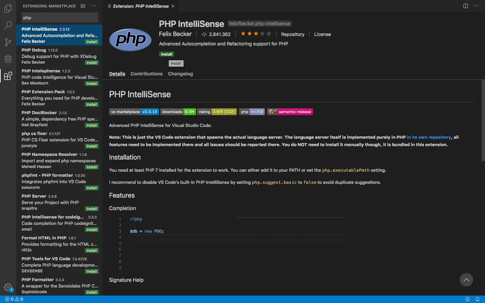

# Unitat 1. Desenvolupament de programari
**Exercici 1**
| Característica | Descripció |
| --- | ------ | 
| Llenguatge   | Javascript | 
| Nivell d’abstracció   | Alto nivel |
| Propòsit   | Lenguaje de script |
| Generació  | Tercera Generació 3GL |
| Forma d’execució   | Compilado y interpretado |
| Com planteja els problemes  | Imperativo y declarativo |
| Paradigma   | Funcional |
| Lloc habitual d’execució  | Cliente |

| Característica | Descripció |
| --- | ------ | 
| Llenguatge   | Java | 
| Nivell d’abstracció   | Alto nivel |
| Propòsit   | General |
| Generació  | Tercera Generació 3GL |
| Forma d’execució   | Compilado y interpretado |
| Com planteja els problemes  | Imperativo |
| Paradigma   | Orientado a objetos |
| Lloc habitual d’execució  | Cliente-servidor |

| Característica | Descripció |
| --- | ------ | 
| Llenguatge   | Python | 
| Nivell d’abstracció   | Alto nivel |
| Propòsit   | General |
| Generació  | Tercera Generació 3GL |
| Forma d’execució   | Interpretado |
| Com planteja els problemes  | Imperativo |
| Paradigma   | Orientado a objetos |
| Lloc habitual d’execució  | Cliente-servidor |

| Característica | Descripció |
| --- | ------ | 
| Llenguatge   | PHP | 
| Nivell d’abstracció   | Alto nivel |
| Propòsit   | General |
| Generació  | Tercera Generació 3GL |
| Forma d’execució   | Interpretado |
| Com planteja els problemes  | Imperativo |
| Paradigma   | Orientado a objetos |
| Lloc habitual d’execució  | Servidor |

| Característica | Descripció |
| --- | ------ | 
| Llenguatge   | C++ | 
| Nivell d’abstracció   | Nivel medio |
| Propòsit   | General |
| Generació  | Tercera Generació 3GL |
| Forma d’execució   | Compilado |
| Com planteja els problemes  | Imperativo |
| Paradigma   | Híbrido |
| Lloc habitual d’execució  | Cliente |

| Característica | Descripció |
| --- | ------ | 
| Llenguatge   | C# | 
| Nivell d’abstracció   | Nivel medio |
| Propòsit   | General |
| Generació  | Tercera Generació 3GL |
| Forma d’execució   | Compilado |
| Com planteja els problemes  | Imperativo |
| Paradigma   | Orientado a objetos |
| Lloc habitual d’execució  | Cliente |

| Característica | Descripció |
| --- | ------ | 
| Llenguatge   | TypeScript | 
| Nivell d’abstracció   | Alto nivel |
| Propòsit   | General y scripts |
| Generació  | Tercera Generació 3GL |
| Forma d’execució   | Compilado |
| Com planteja els problemes  | Imperativo |
| Paradigma   | Orientado a objetos y funcional |
| Lloc habitual d’execució  | Cliente-servidor |

| Característica | Descripció |
| --- | ------ | 
| Llenguatge   | Shell | 
| Nivell d’abstracció   | Nivel bajo |
| Propòsit   | Script |
| Generació  | Tercera Generació 3GL |
| Forma d’execució   | Interpretado |
| Com planteja els problemes  | Declarativo |
| Paradigma   | Procedurals |
| Lloc habitual d’execució  | Cliente |

| Característica | Descripció |
| --- | ------ | 
| Llenguatge   | C | 
| Nivell d’abstracció   | Alto nivel |
| Propòsit   | General |
| Generació  | Tercera Generació 3GL |
| Forma d’execució   | Compilado |
| Com planteja els problemes  | Imperativo |
| Paradigma   | Procedurals |
| Lloc habitual d’execució  | Cliente |

| Característica | Descripció |
| --- | ------ | 
| Llenguatge   | Ruby | 
| Nivell d’abstracció   | Alto nivel |
| Propòsit   | General |
| Generació  | Tercera Generació 3GL |
| Forma d’execució   | Interpretado |
| Com planteja els problemes  | Imperativo |
| Paradigma   | Orientado a objetos |
| Lloc habitual d’execució  | Cliente |

**Exercici 2**

LibreOffice: es un paquete de software de oficina libre y de código abierto desarrollado por The Document Foundation. Se creó en 2010 como bifurcación de Apache OpenOffice, otro antiguo proyecto de código abierto, que a su vez tenía como base inicial a la suite ofimática StarOffice, desarrollada por StarDivision, adquirida por Sun Microsystems en agosto de 1999. Su entorno está programado en los lenguajes informáticos C++, Java y Python.


Mozilla Firefox: es un navegador web libre y de código abierto desarrollado para Linux, Android, iOS, macOS y Microsoft Windows coordinado por la Corporación Mozilla y la Fundación Mozilla. Usa el motor Gecko para renderizar páginas web, el cual implementa actuales y futuros estándares web. Fue programado con C++.


GIMP: es un programa de edición de imágenes digitales en forma de mapa de bits, tanto dibujos como fotografías. Es un programa libre y gratuito. Forma parte del proyecto GNU y está disponible bajo la Licencia pública general de GNU y GNU Lesser General Public License. Es el programa de manipulación de gráficos disponible en más sistemas operativos (Unix, GNU/Linux, FreeBSD, Solaris, Microsoft Windows y macOS, entre otros). Fue programado en C.


Plucker: lucker es un lector de documentos, publicado como software libre, para dispositivos de mano y PDAs basados en Palm OS. Tiene su propio formato de archivos Plucker. Además de la aplicación lectora para Palm, Plucker también proporciona varias herramientas para convertir y comprimir páginas web y otros documentos en formato HTML o de texto al formato Plucker, y transferirlos a un dispositivo Palm para su lectura. Las herramientas se encuentran disponibles para Unix y Linux, Windows y Mac OS X. Plucker es software libre bajo la licencia GPL. Fue programado en C y Java.


Skype: es un software propietario distribuido por Microsoft tras haber comprado la compañía homónima y que permite comunicaciones de texto, voz y vídeo sobre Internet (VoIP). Fue diseñado en 2003 por el danés Janus Friis y el sueco Niklas Zennström y desarrollada en su solución técnica por los estonios Priit Kasesalu, Ahti Heinla y Jaan Tallinn, ya que de hecho Skype nació en Tallin, Estonia. El código y protocolo de Skype permanecen cerrados y son privativos de la aplicación, pero los usuarios interesados pueden descargar gratuitamente la aplicación ejecutable del sitio web oficial. Los usuarios de Skype pueden hablar entre sí gratuitamente. Fue programado en Embarcadero Delphi, Objective-C, C++, Object Pascal y JavaScript.


Opera: es un navegador web creado por la empresa noruega Opera Software. Usa el motor de renderizado Blink. Tiene versiones para computadoras de escritorio, teléfonos móviles y tabletas.
Los sistemas operativos compatibles con Opera de escritorio son Microsoft Windows, Mac OS X y GNU/Linux (Ubuntu, Fedora 64-bit) entre otros. Los sistemas operativos móviles soportados son Maemo, BlackBerry, Symbian, Windows Mobile, Windows Phone, Android e iOS; así como la plataforma Java ME. Existe también una suite de Internet antigua de Opera, basada en el motor Presto, que aún sigue recibiendo soporte de seguridad. Fue programado en C++.


**Exercici 3**
Python
Edito el archivo ya creado anteriormente llamado hello.py e introduciré el siguiente codigo:
print "Hola a tots! Em diuen Luis Nares Signes i estudie 1r de DAM!"
Despues saldremos del editor e introduciremos el siguiente comando en consola para poder interpretarlo:
python hello.py

Nodejs
Edito el archivo ya creado anteriormente llamado hello.js e introduciré el siguiente codigo:
console.log(Hola a tots! Em diuen Luis Nares Signes i estudie 1r de DAM!);
Despues saldremos del editor e introduciremos el siguiente comando en consola para poder interpretarlo:
nodejs hello.js

C
Edito el archivo ya creado anteriormente llamado hello.c e introduciré el siguiente codigo:
#include <stdio.h>
int main(void)
{
    printf("Hola a tots! Em diuen Luis Nares Signes i estudie 1r de DAM!")
}
Despues saldremos del editor e introduciremos el siguiente comando en consola para poder compilarlo:
gcc hello.c -o hello
Con esto se creara otro archivo llamado hello el que contendrá el mensaje. Ahora para ejecutarlo simplemento ejecutamos el siguiente comando: 
./hello

Java
Creo un archivo llamado hello.java e introduciré el siguiente codigo:
class HolaMon {
    static public void main( String args[]) {
        System.out.println("Hola a tots! Em diuen Luis Nares Signes i estudie 1r de DAM!");
    }
}

Despues saldremos del editor e introduciremos el siguiente comando en consola para poder compilarlo:
javac hello.java
Despues se creara otro archivo llamado HolaMon que solo se puede ejecutar de la siguiente manera:
java HolaMon

# Unitat 2. Eines per al desenvolupament de programari
## Memòria pràctica VSCode (instal·lació d'extensions)


# Unitat 3. Sistemes de control de versions
## Memòria de l'exercici d'RCS 

1. Creeu un fitxer anomenat exercici.md, i afegiu-li algun contingut en format Markdwon.  
touch exercici.md  
nano exercici.md  
cat exercici.md  
Output: Prueba1  

2. Registreu el fitxer per a que el controle RCS.  
ci -u exercici.md  

3. Intenteu modificar el fitxer, per veure si teniu o no permís.  
No, no tenim permís.

4. Feu un checkout del fitxer, ara sí, per afegir canvis.  
co -l exercici.md

5. Modifiqueu el fitxer i afegiu-li més contingut. Aquesta serà la versió 1.2.  
nano exercici.md  
ci -u exercici.md 

6. Amb un altre usuari, intenteu modificar el fitxer (fent el checkout abans).  
En el mac no podia canviar de usuari en terminal.  

7. Com a l’usuari original, registreu els canvis al fitxer.  


8. Si podeu, afegiu més informació al fitxer, ara serà la versió 1.3.  
nano exercici.md  
ci -u exercici.md  

9. Com a l’usuari original, visualitzeu les diferències entre les versions, i torneu a la versió 1.2.  
Com no es poden vore les diferencies de les 3 versions tenim que fer entre la 1 i la 2 i despres la 2 i la 3.  
rcsdiff -r1.1 -r1.2 exercici.md  
rcsdiff -r1.2 -r1.3 exercici.md  
Per a tornar a la versio 1.2: co -r1.2 exercici.md
10. Apliqueu més canvis i guardeu-los amb la versió 1.4.  
Escrivim algo:
nano exercici.md  
ci -u exercici.md  
Fiquem versio 4 un . i este sera la versió 1.4

## Memòria d'instal·lació de Subversion Edge i exercicis sobre svn.

### Instalación docker
Lo primero que haremos es actualizar los repositorios y después instalar todos los paquetes para poder realizar la instalación de Docker.

```sudo apt install apt-transport-https ca-certificates curl software-properties-common```

Con el siguiente comando descargué y agregué la llave de Docker

```curl -fsSL https://download.docker.com/linux/ubuntu/gpg | sudo aptkey add -```

Agregué el repositorio con el siguiente comando:

```sudo add-apt-repository "deb [arch=amd64] https://download.docker.com/linux/ubuntu $(lsb_release -cs) stable"```

Una vez hecho todo esto simplemente instalaremos el paquete de docker:

```sudo apt-get install docker-ce```


### Instalación subversion
Executarmen el següent comando per a instalar subversion:
```docker run -d mamohr/subversion-edge```

Ara tenim que parar i eliminar el contenidor de la seüent manera:
```docker ps```
Li farem un docker stop i docker rm a eixe contenidor:  
```docker stop 3a44963e4e29```  
```docker rm 3a44963e4e29```  
Ara tornarem a llençar el contenidor de la següent forma:  
```docker run -d -p 3343:3343 -p 4434:4434 -p 18080:18080 --name svnserver mamohr/subversion-edge bcebfd61510e4fb5c456503a81c528f535d2407a90df1a8a031b1300edc8335a```  

### SVN
Per a poder accedir al nostre repositori hem de agafar el comando que ens fique en el subversion. Será algo paregut a aço:  
```svn co http://127.0.0.1:18080/svn/test test```

Ficarem la contrasenya del nostre usuari de subversion.

## Memòria dels exemples pràctics amb git.

### GIT
Primer hem de clonar el git en una carpeta de la nostra maquina en el següent comando:  
```git clone UrlQueEnsDoneGithub```  

Per a agregar els nous fitxers al github farem els següents comandos:  
```git init```  
```git add .```  
```git commit -m "first commit"```  
```git remote add origin https://github.com/NOMBRE_USUARIO/NOMBRE_PROYECTO.git```  
```git push -u origin master```


